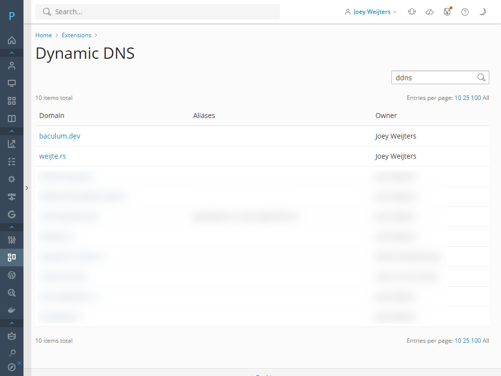
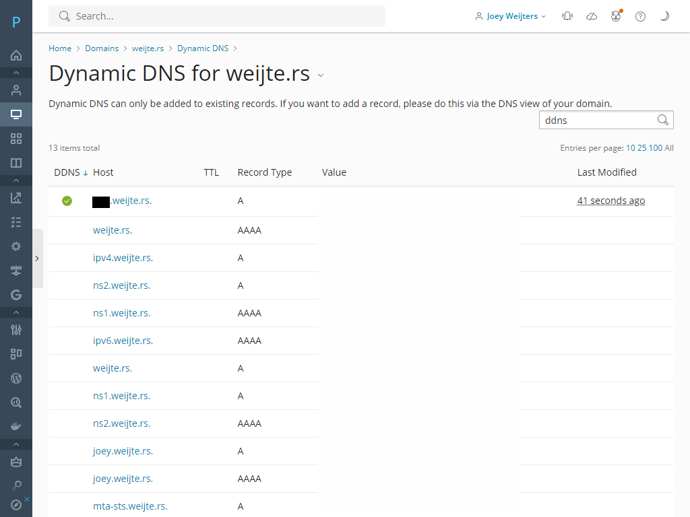
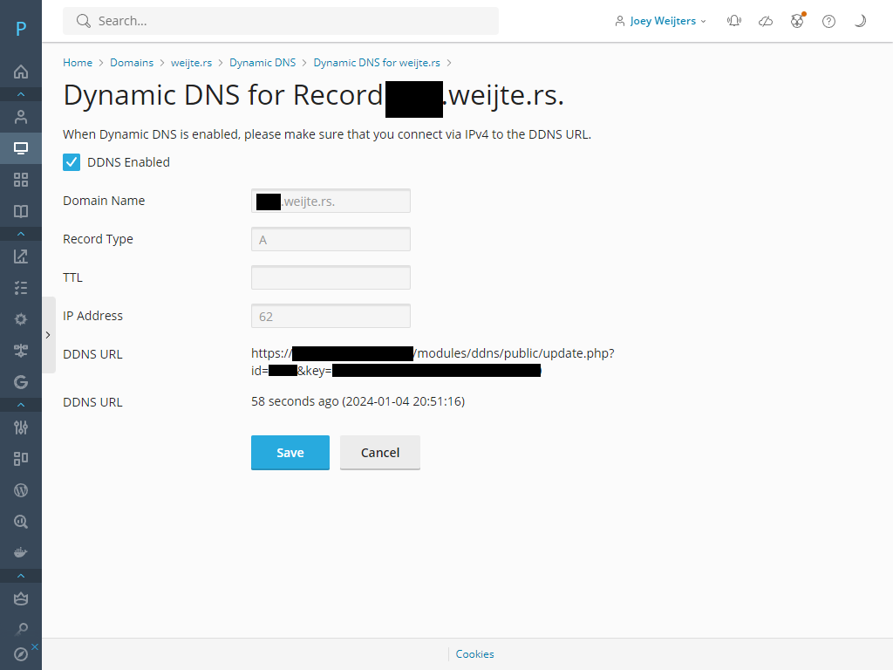
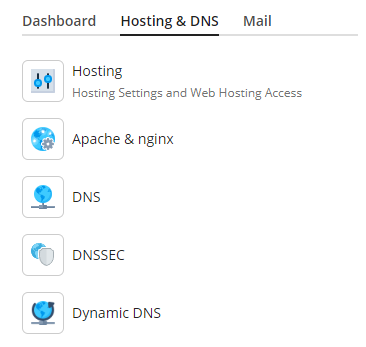

# Plesk Dynamic DNS
This addon adds dynamic DNS functionality to Plesk.

# Installation
1. Download the latest release from the Releases page
2. Upload to server
3. Install with `plesk bin extension -i /path-to/ddns-version.zip`
4. Have fun!

# Usage
There are multiple ways enable DDNS for a domain name.
## Way 1: Via Websites & Domains
1. Go to the domain for which you want to enable Dynamic DNS
2. Go to the Hosting & DNS tab
3. Click on Dynamic DNS
4. Click on the subdomain name you want to enable Dynamic DNS for
5. Check "DDNS Enabled" and press safe

## Way 2: Via Extensions Page
1. Open the extension from the Extensions page
2. Click on the domain you want to enable Dynamic DNS for
3. Click on the subdomain name you want to enable Dynamic DNS for
4. Check "DDNS Enabled" and press safe

You can now use Dynamic DNS for the selected subdomain. You can disable Dynamic DNS by unselecting the "DDNS Enabled" checkbox and clicking save.

If you want to update a record, you can make a request to the DDNS URL specified the "Dynamic DNS for Record" page. You can do this by browsing to it or use curl for example.

Dynamic DNS can be used for all A and AAAA records. Be wary that you don't accidentally enable it for records that point to locally hosted websites.

# Screenshots

# Features for further implementation
- Add logging

Currently the plugin does not log any requests to the update endpoint. The idea is to log all requests for administrators.
- Add finegrained permissions

Currently the plugin shows all the domains a user has access to, there is no way to block a user from using DDNS if DNS is enabled on a domain.

- Add localization

Currently the plugin is only available in English.

# Contributing
Feel free to contribute! I am developing this in my own free time, you may always ask for features to be added, but there is NO guarantee that I will do it. Feel free to make pull requests if you want to add extra features.

# License
Plesk DDNS is licensed under the Unlicense. Feel free to use it.